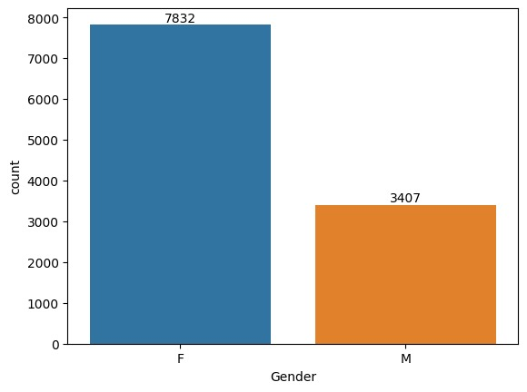
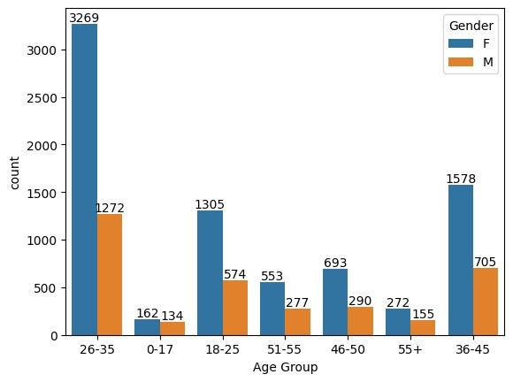
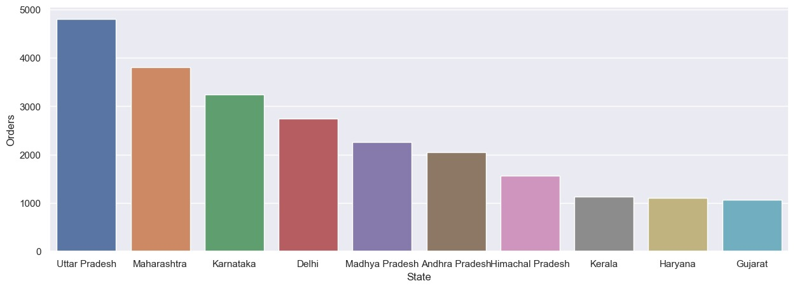
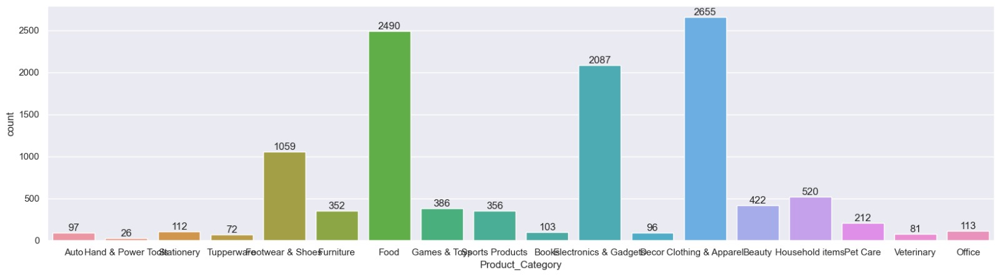

# 🪔 Diwali Sales Analysis

## 📌 Project Overview
This project analyzes Diwali sales data using Python to uncover customer purchasing patterns and generate business insights through Exploratory Data Analysis (EDA).

## 🛠️ Tools & Technologies
- Python
- Pandas
- NumPy
- Matplotlib
- Seaborn
- Jupyter Notebook

## 📊 Objectives
- Clean and preprocess the dataset
- Perform Exploratory Data Analysis (EDA)
- Analyze customer demographics
- Identify top-performing states and product categories
- Generate actionable business insights

## 📈 Key Insights
- Female customers contributed more to total purchases than male customers.
- Customers aged 26–35 made the highest number of purchases.
- Uttar Pradesh, Maharashtra, and Karnataka recorded the highest sales.
- Married women working in IT, Healthcare, and Aviation were among the top buyers.

## 📂 Files Included
- `Diwali_Sales_Analysis.ipynb` – Jupyter Notebook
- `Diwali Sales Data.csv` – Dataset

## 🚀 Skills Demonstrated
- Data Cleaning
- Exploratory Data Analysis (EDA)
- Data Visualization
- Business Insight Generation
- Python for Data Analytics

---

# 📊 Project Visualizations

## Gender-wise Sales

## Age Group Analysis

## State-wise Sales

## Product Category Analysis

---

# 💡 Business Recommendations

Based on the analysis, the following recommendations can help improve sales performance:

- Focus marketing campaigns on women aged **26–35**, as they represent the highest purchasing segment.
- Increase inventory in **Uttar Pradesh, Maharashtra, and Karnataka** during festive seasons.
- Promote high-performing product categories with targeted discounts and bundle offers.
- Offer personalized festive promotions to repeat customers to improve customer retention.
- Use customer demographic insights to design region-specific marketing strategies.

---

# 📌 Conclusion

This project demonstrates how Exploratory Data Analysis (EDA) can transform raw sales data into meaningful business insights. Using Python and visualization libraries, the analysis identifies customer purchasing patterns and provides actionable recommendations for improving sales and marketing strategies.
## 👩‍💻 Author
**B. Susheela**

LinkedIn: https://www.linkedin.com/in/bsusheela
GitHub: https://github.com/B-Susheela
